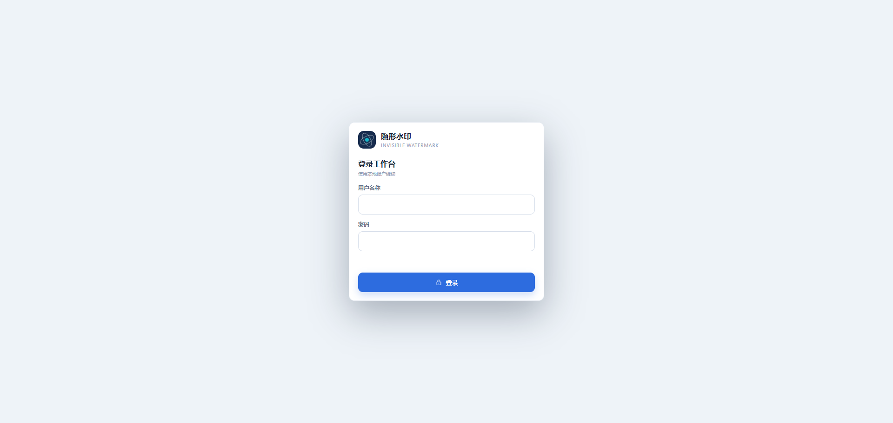
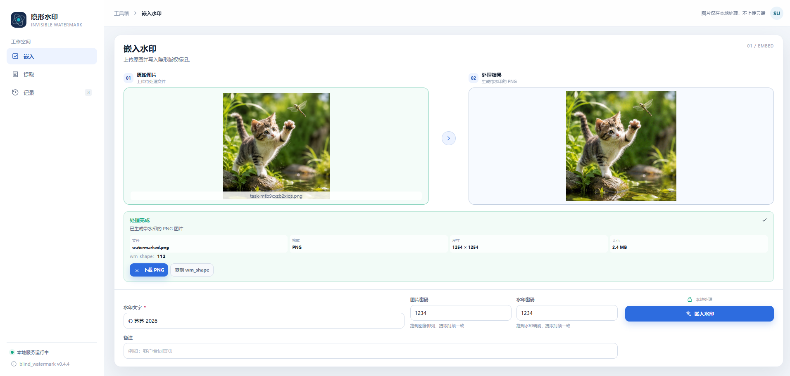
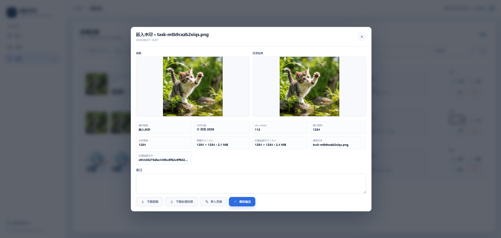
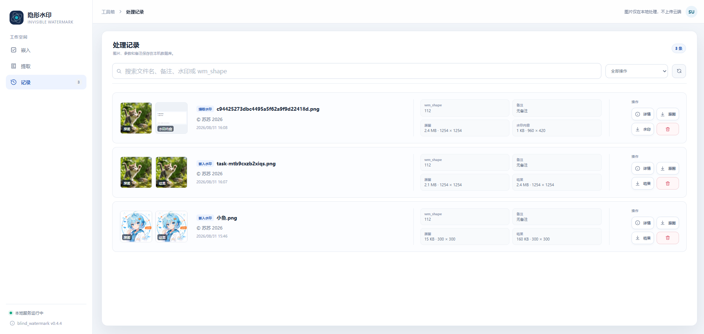
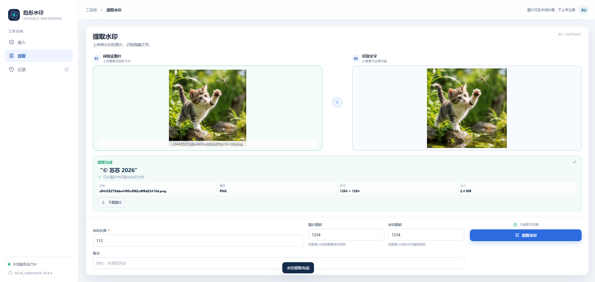
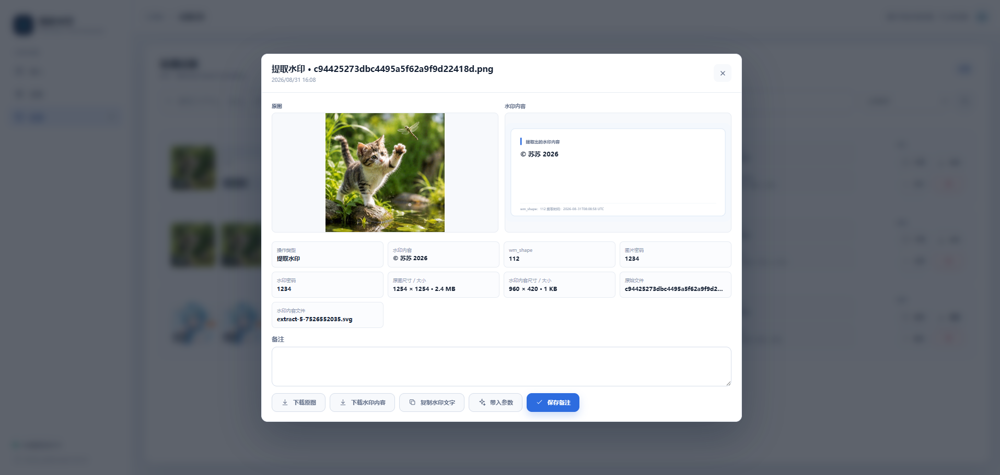

<div align="center">
  
  <h1>Invisible Watermark WebUI</h1>
  <p>本地隐形水印嵌入、提取与记录管理工作台</p>
  <p>基于 Flask、Galaxy UI 和 <a href="https://github.com/guofei9987/blind_watermark">blind_watermark</a>，图片与账户数据默认只保存在本地。</p>
  <p>
    
    
    
    
  </p>
  <p>
    
    
    
  </p>
</div>

## 项目简介

Invisible Watermark WebUI 是一个面向个人和小团队的本地图片水印工作台。它将 `blind_watermark` 算法封装成清晰的 Web 操作界面，用于在图片中嵌入隐形文字水印、普通提取水印、从裁剪或缩放后的图片恢复提取水印，并保存可检索的处理记录。

图片处理在后端本地执行，不会自动上传到云端。应用提供首次访问初始化账户、登录鉴权、账户信息修改、SQLite 记录、原图/结果图下载和移动端适配。

## 界面预览

<table>
  <tr>
    <td align="center"><strong>登录与初始化</strong><br></td>
    <td align="center"><strong>嵌入水印工作台</strong><br></td>
    <td align="center"><strong>嵌入记录详情</strong><br></td>
  </tr>
  <tr>
      <td align="center"><strong>处理记录</strong><br></td>
    <td align="center"><strong>提取水印工作台</strong><br></td>
    <td align="center"><strong>提取记录详情</strong><br></td>
  </tr>
</table>


## 功能特性

- **嵌入水印**：上传 PNG/JPG 图片，输入水印文字和参数，输出带隐形水印的 PNG。
- **普通提取**：上传未经裁剪或缩放的带水印图片，填写嵌入时的 `wm_shape` 和统一密码，直接提取文字。
- **恢复提取**：使用历史嵌入结果或手动上传的完整水印参考图，估算裁剪坐标和缩放比例，恢复画布后再提取文字。
- **文本复制**：提取结果中的水印文字可以直接复制；结果 SVG 仅作为预览和下载用的展示图。
- **图片预览**：原图和结果图支持点击放大，查看器内支持下载。
- **快速重置**：每个上传框可以单独清除图片，嵌入、普通提取和恢复提取也可以一键清空本次图片与结果后重新开始。
- **处理记录**：保存原图、水印文字、`wm_shape`、密码参数、备注、文件尺寸和结果图，支持模糊搜索、详情、下载和删除。
- **批量管理**：记录列表支持全选当前筛选结果并批量删除，删除时同步清理所属本地图片文件。
- **本地鉴权**：首次没有用户时显示初始化注册；完成初始化后只显示登录页。账户设置支持修改用户名和密码。
- **响应式布局**：桌面端使用侧栏导航，移动端使用底部导航，核心工作区适配窄屏。
- **本地存储**：SQLite 保存元数据，图片保存在 `data/uploads` 和 `data/results`，可通过 Docker volume 持久化。
- **文件限制**：默认单个上传文件最大 50 MB，支持浏览器拖拽上传。

## 水印参数

界面默认使用一个“图片和水印密码”，并把同一个值用于图像排列和水印编码，减少需要保存的参数。提取时必须与嵌入时保持一致。

- **图片和水印密码**：同时控制图像处理的像素排列和水印编码。
- **分别填写（兼容旧记录）**：旧记录曾使用两组不同密码时可以展开该选项，分别填写图片密码和水印密码。
- **wm_shape**：嵌入时返回的水印长度，提取时必须填写同一个值。

默认统一密码是 `1234`。生产或多人共用环境建议设置自己的参数并妥善保存。

## 恢复提取

恢复提取调用 `blind_watermark.recover.estimate_crop_parameters` 和 `recover_crop`，用于待提取图片被裁剪、等比例缩放，或先裁剪再等比例缩放的情况。

### 使用历史嵌入记录（推荐）

1. 先在“嵌入”页面生成带水印的完整 PNG，保留自动创建的嵌入记录。
2. 进入“提取”页面，切换到“恢复提取”。
3. 在完整水印参考图上方的历史记录下拉框中选择对应记录，参考图会直接显示在共用上传区域中。后端会读取该记录的完整水印结果图、`wm_shape`、图片密码和水印密码。
4. 上传经过裁剪或缩放的待提取图片，点击“恢复并提取”。

### 手动上传参考图

1. 直接把当初嵌入水印后生成的完整水印结果图拖入共用的参考图区域，或点击该区域选择文件。新文件会自动覆盖已选择的历史记录。
2. 再上传经过裁剪或缩放的待提取图片。
3. 填写嵌入时对应的 `wm_shape` 和统一密码；旧记录使用两组不同密码时展开兼容选项，然后开始恢复。

“完整水印参考图”不是未添加水印的原始图片。恢复成功后页面会显示提取文字、匹配置信度 `score`、推测裁剪坐标、推测缩放比例和恢复后的图片。恢复记录还会保存这些估算参数，并可在历史详情中查看和下载相关文件。

### 适用范围与限制

- 第一版支持裁剪、等比例缩放，以及裁剪后等比例缩放。
- 待提取图片的宽或高不能大于完整参考图。
- 旋转、加边框、真实手机拍照、透视变形和非等比例拉伸暂不保证恢复效果。
- `score` 低于 `0.15` 时接口按无法匹配处理；低于 `0.45` 时仍返回结果，但页面会提示“参考图与待提取图片可能无法匹配”。
- 水印越短、保留的有效画面越多，通常越容易在裁剪和缩放后正确恢复。算法本身不提供密码校验码，错误密码可能产生乱码，也可能触发提取错误。

## Docker 部署

镜像支持 `linux/amd64` 和 `linux/arm64`：

- `tannic666/watermark-webui:v1.0.0`
- `tannic666/watermark-webui:latest`

### Docker Compose（推荐）

根目录的 `docker-compose.yml` 默认将数据保存到 `./data`：

```bash
docker compose pull
docker compose up -d
```

### Docker Run

多行命令：

```bash
docker run -d \
  --name watermark-webui \
  --restart unless-stopped \
  -p 8655:8655 \
  -e WATERMARK_SECRET_KEY=replace-with-a-long-random-value \
  -v "${PWD}/data:/app/data" \
  tannic666/watermark-webui:v1.0.0
```

单行命令：

```bash
docker run -d --name watermark-webui --restart unless-stopped -p 8655:8655 -e WATERMARK_SECRET_KEY=replace-with-a-long-random-value -v "${PWD}/data:/app/data" tannic666/watermark-webui:v1.0.0
```

启动后访问 `http://localhost:8655`。账户、数据库和图片均保存在本地 `data/` 目录。双架构镜像构建说明见 [`docker/README.md`](./docker/README.md)。镜像会自动创建本地数据子目录并处理容器用户权限，业务进程以非 root 的 `watermark` 用户运行。

## 本地运行

### 环境要求

- Python 3.11+
- OpenCV 可用的运行环境

### 安装与启动

```bash
python -m venv .venv

# macOS / Linux
source .venv/bin/activate

# Windows PowerShell
# .\.venv\Scripts\Activate.ps1

pip install -r requirements.txt
python app.py
```

生产环境可以使用 Gunicorn：

```bash
gunicorn --bind 0.0.0.0:8655 --workers 2 --timeout 120 app:app
```

### 运行测试

```bash
pip install -r requirements-dev.txt
python -m pytest -q
```

测试覆盖普通提取回归、裁剪恢复、裁剪后缩放恢复、历史和手动参考来源、无效图片、无匹配结果、跨用户访问与存储路径校验。

## 配置项

| 环境变量 | 默认值 | 说明 |
| --- | --- | --- |
| `WATERMARK_SECRET_KEY` | `change-this-local-secret` | Flask 会话签名密钥，部署时应替换 |
| `WATERMARK_DATA_DIR` | 项目目录下的 `data` | SQLite、上传图和结果图的根目录 |
| `WATERMARK_COOKIE_SECURE` | `false` | HTTPS 部署时可设置为 `true` |

## API

除 `/api/health` 外，API 均需要先登录。图片接口使用 `multipart/form-data`。

| 方法 | 路径 | 说明 |
| --- | --- | --- |
| GET | `/api/health` | 健康检查 |
| GET | `/api/auth/status` | 查询登录状态和是否需要初始化 |
| POST | `/api/auth/register` | 无用户时初始化注册 |
| POST | `/api/auth/login` | 本地会话登录 |
| POST | `/api/auth/logout` | 退出登录 |
| PATCH | `/api/auth/account` | 修改用户名或密码 |
| POST | `/api/embed` | 嵌入文字水印并创建记录 |
| POST | `/api/extract` | 提取文字水印并创建记录 |
| POST | `/api/extract/recover` | 恢复裁剪/缩放图片并提取水印；支持历史记录 ID 或手动参考图 |
| GET | `/api/records` | 按 `q` 模糊搜索记录，可用 `operation=embed\|extract` 筛选 |
| GET | `/api/records/<id>` | 获取记录详情和参数 |
| PATCH | `/api/records/<id>` | 更新备注 |
| DELETE | `/api/records/<id>` | 删除记录及关联图片 |
| DELETE | `/api/records/batch` | 批量删除当前用户的记录及关联图片，JSON 传入 `ids` 数组 |
| GET | `/api/records/<id>/original` | 查看或下载原图，追加 `?download=1` 下载 |
| GET | `/api/records/<id>/result` | 查看或下载结果图，追加 `?download=1` 下载 |
| GET | `/api/records/<id>/reference` | 查看或下载恢复提取使用的完整水印参考图 |
| GET | `/api/records/<id>/recovered` | 查看或下载恢复后的图片 |

嵌入和提取接口可以传一个 `password` 作为统一密码；兼容旧记录时仍可分别传 `pwd_img` 和 `pwd_wm`。恢复接口使用 `multipart/form-data`。历史来源传入 `reference_source=history`、`history_record_id` 和待提取文件 `image`；手动来源传入 `reference_source=manual`、`reference_image`、`image`、`wm_shape` 和 `password`，或分别传两个旧版密码字段。历史记录必须属于当前登录用户且必须是嵌入记录。

## 目录结构

```text
watermark-webui/
├── app.py                    # Flask 后端、鉴权、SQLite 和图片处理 API
├── static/
│   ├── index.html             # Galaxy UI 单页前端
│   └── logo.svg               # Web 页面运行时 Logo
├── docs/
│   ├── images/                # README 界面截图
│   └── logo/                  # README 使用的品牌 Logo
├── data/                      # 本地运行数据目录（仅保留 .gitkeep）
│   ├── uploads/               # 用户上传的原图
│   ├── results/               # 处理结果和提取内容 SVG
│   └── watermark.db           # SQLite 数据库
├── docker/
│   ├── Dockerfile              # 生产镜像构建文件
│   ├── build-push.ps1          # amd64/arm64 镜像构建与推送脚本
│   └── README.md               # Docker 构建、部署与发布说明
├── docker-compose.yml          # Compose 部署配置
├── requirements.txt           # Python 依赖
├── requirements-dev.txt       # 测试依赖
├── tests/                     # Flask API 与真实 blind-watermark 恢复测试
├── COMMIT_RULES.md             # 仓库提交信息规范
├── .dockerignore
├── .gitignore
└── README.md                   # 项目说明
```

## 注意事项

- 提取时必须使用嵌入时对应的 `wm_shape`、图片密码和水印密码。
- 嵌入结果统一输出 PNG；对图片进行压缩或二次处理可能影响水印提取。
- 启动时会为旧版 SQLite 数据库幂等补充恢复记录字段，原有嵌入和普通提取记录会保留。
- `data/` 包含账户、密码哈希、参数和图片文件，已加入 `.gitignore`，请使用 Docker volume 或备份目录保存。
- 默认会话密钥仅适合本地开发，部署前请设置足够长度的 `WATERMARK_SECRET_KEY`。
- 当前前端通过 CDN 加载 Galaxy UI；离线环境需要将 Galaxy 资源改为本地静态文件。

## 相关项目

- 应用仓库：[JunWan666/watermark-webui](https://github.com/JunWan666/watermark-webui)
- 算法库：[guofei9987/blind_watermark](https://github.com/guofei9987/blind_watermark)
